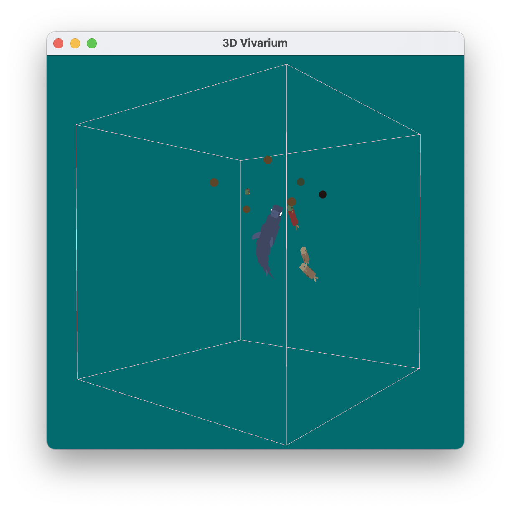

# 3D Vivarium README

## 1. Overview

This program uses OpenGL as the underlying platform to depict an amazing platform to display a wonderful vivarium (aquarium). In the aquarium there're three kinds of creatures: Sharks, Cods and Salmons. The Shark is the grey predator, which will keep hunting for smaller fishes. Cods and Salmons will keep escaping from the shark, while eating the food.

The techniques used in this vivarium include but are not limited to the following:

*   **Using quaternion** to perform arbitrary angle rotation.

*   Using multiple gradient descant method.

*   Tank wall as potential functions so the fish will try to turn when approaching the edges. (Potential functions)

*   Fishes will try to reflect when collided with each other. **(Hit test)**

*   Fishes will try to keep group movement. **(Potential functions)**

*   The shark will try to eat the fish, and the fish will try to eat the food. (Potential functions)

*   Food has unique gravity feature than other objects.

*   Shark will try not to eat the fish until all the food has been eaten.

## 2. Instructions for running the program:

1. First, please install version 3.8 of Python or install Anaconda/Miniconda.
   - If you choose conda, please use `conda create -n GRAPHICS` after installation to create an environment named GRAPHICS. Then use `conda activate GRAPHICS` to enter that environment.
2. Use `pip install -r requirements.txt` to install the required packages: PyOpenGL, WxPython, and Numpy.
3. Run the program by executing the command `pythonw Sketch.py`

   > On Mac, please use `python.app`.

If you encounter any problems during the run, please submit an Issue.

---

Run the program and the window will show. By default there will be two salmons(red), two cods (golden) and one shark (gray).


*   Press `A` to add two fishes, one of which is a salmon, and the other is a cod.

*   Press `F` to add several food. Both the shark and fish will try to eat it.



> Notes: add two many fishes can cause lags in changing views. Therefore it's not recommended to add to much creatures.

## 3. Model Design

I used a custom `CS680PA3` class when defining the model, which adds a series of additional fields to help calculate model collisions. This class is inherited from the `Component` and `EnvironmentObject` class.

### 3.1 `CS680PA3` members

*   `RotWrap` subclass

    RotWrap stands for Rotation Wrap Object. Each object contains a `Component` value and a \[u, v, w] value, stands for the rotation speed of each part.

*   `rotationRegistry`: A list of `RotWrap`

    All classes will register in this the parts that need to be turned, and the speed of the turn. The contents of this registry can then be read during the execution of the rotation to perform the rotation:

    ```python
    def animationUpdate(self):
        for i, wrap in enumerate(self.rotationRegistry):
            comp = wrap.comp
            speed = wrap.rotation_speed
            comp.rotate(speed[0], comp.uAxis)
            comp.rotate(speed[1], comp.vAxis)
            comp.rotate(speed[2], comp.wAxis)
            # ...
        self.update()
    ```

*   `basic_boundary_radius`: float and `boundary_radius` property.

    `basic_boundary_radius` stores the original radius of the model. When the property is accessed, it will multiply the original radius value with the maximum value of the current scale.

*   `basic_boundary_center`: Point and `boundary_center` property.

    Since the center point of some organisms is not the center of its body (e.g. salmons), an additional offset is needed. Same to the boundary\_radius property, this property will also multiply with the scale.

    

*   `basic_speed`: float and `speed` property

    `basic_speed` is the original speed. The speed of a creature represents the how fast the creature is moving. In this program, the speed of shark and fish movement is always constant.

*   `step_vector`: \[u, v, w]&#x20;

    It stores the direction that the creature will move. It will always be a unit vector.

*   `orientation`: \[u, v, w]&#x20;

    It define the current orientation of the creature. The quaternion part will use this vector to compute the rotation.&#x20;

*   `food_chain_level`: int

    Defines the level of the food chain. The smaller represents the topper level. A creature of higher level can eat that of lower level. **High-ranking creatures must eat the lowest-ranking creatures first, and then eat the second-lowest.** This is for ornamental purposes, as I don't want the shark kill the fish in advance when they are hunting for fish food together.

### 3.2 The Shark


The shark's default size is `2`. Its hit sphere center is `[0, 0, 0]` and its boundary radius is `1.8`. The basic speed is `0.05`. Food chain level is `100`.

### 3.3 The Cod


The cod's default size is `1.6`. Its hit sphere center is `[0, 0, -1.2]` and its boundary radius is `1.6`. The basic speed is `0.3`. Food chain level is `200`.

### 3.4 The Salmon


The salmon's default size is `2`. Its hit sphere center is `[0, 0, -1.7]` and its boundary radius is `2`. The basic speed is `0.3`. Food chain level is `200`.

### 3.5 The food

The food is just a sphere with random food color. Unlike other creatures, it will only fall down at a common speed till the bottom of the tank.

---


## 4. Avoiding out of tank bounds

The program detects and prevents fish from swimming out of the tank. The detection formula is:

`-tank_lower_edge + radius < creature.position + creature.boundary_center < tank_edge_max - creature.radius`.


Any dimension beyond that will cause the speed of the fish's current dimension to flip right over and swim in the opposite direction.

## 5. Collision detection and creatures react to each other

In the program, the creatures will interact according to the following pattern:

*   To avoid the fish always hitting the wall of the tank, there is therefore a potential energy function at a distance of 0.1 from the tank. For the upper edge, the potential function is $n^x$, for the lower edge, it's $n^{-x}$. This allows the fish to make a perfect turn before hitting the wall. The graph can be illustrated as the follows:

    

    

    Suppose the boundary is -2 to 2. Then the function is designed in such a way that the derivative value increases as it approaches the boundary 2, forcing the fish to move in the negative direction. When approaching the boundary -2, the value of the derivative becomes smaller and smaller (negative), causing the fish to move in the positive direction. This way the fish will not easily try to approach the tank. In practice, the potential energy function is set to `-1.9` to `1.9` in order to avoid conflicts with the tank wall hit box.

    The hyper parameters are as follows:

    *   $n$ is 30.

    *   When the calculation is complete, the step is multiplied by a step size of `0.09`.

*   If two organisms are at different levels of the food chain, the lower level organism will be eaten by the higher level organism. The prey will try to escape from the hunter using the derivative of $e^{-x^2}$ as gradient descent (it's a variant of the gaussian function), while the hunter will optimize in the opposite direction to chase the prey. The graph can be illustrated as the follows:

    _fTfOTU2SDZ.svg "The potential function.")

    

    The main reasons for using this function are as follows：

    *   When two objects are too close to each other, in the derivative function, if the distance is positive (close to 0), gradient descent minus a larger negative value will cause the object to move away from the 0 point and in the positive direction. If it is negative (close to 0), subtracting a larger positive value will make the object move in the negative direction. This all ensures that the object moves away from the 0 point.

    The hyper parameters are as follows:

    *   When the calculation is complete, for the predator, the step is multiplied by a step size of `0.05`. for the prey, the step is multiplied by `0.04`. (This make prey a bit vulnerable to the predator).

*   If two organisms are of the same level, they will reflect each other's motion acceleration when they meet. Note that the acceleration of the motion is changed here, not the original velocity.

    The hyper parameters are as follows:

    When get the reflection vector, it will be multiplied with 0.3, so the effect will not be so obvious. The reason for this is to avoid that when two fish collide head-on, the direct reversal causes the two fish to keep exchanging positions with each other.

*   An inversion function is used to make sure that the fish will form schools to ensure they follow the overall movement. The details can be viewed at [here](http://www.red3d.com/cwr/boids/ "here"). This will be discussed in the 7. Boids (Group behavior).

## 6. Rotation using quaternion:

In this program, I have used quaternions to perform rotations in the following way.

Each object has a current new direction, as well as the direction it is currently facing. Suppose the current direction is $\textbf{v}_1$, and the new direction is $\textbf{v}_2$.

The rotation of a quaternion requires an axis of rotation, as well as a rotation angle. We can easily achieve this by vector cross product and dot product.


Once you have obtained two values, we can use quaternions for rotation. The pseudo-code is as follow:

```python
rotate_axis = v1.cross3d(self.orientation)
rotate_angle = v1.angleWith(self.step_vector)
rotate_q = Quaternion.axisAngleToQuaternion(rotate_axis, rotate_angle)
self.setPostRotation(rotate_q.toMatrix())
```

Where `axisAngleToQuaternion` corresponds to the quaternion rotation formula. The formula is as follow:

$$
\begin{aligned} \mathbf{q} &=s+\mathbf{v} \\ &=s+t \mathbf{A} \\ &=\cos \frac{\theta}{2}+\mathbf{A} \sin \frac{\theta}{2} \end{aligned}
$$

where $\mathbf{A}$represent the rotation axis, and $\theta$ is the rotation angle.

## 7. Boids (Group behavior)

For the group behavior, the fish will have the following characteristics

1.  When fish are too spread out, they will try to approach each other

2.  When the fish are too close together again, they will separate away.

3.  The fish will move in as similar a direction as possible, i.e., in the same direction.

I solved it using the following approach and designed the potential energy function as follows:

$$
df(\mathbf{x}) / d \mathbf{x} = \left(-\frac{a}{\operatorname{Abs}(\mathbf{x})} + b\right) * \operatorname{sign}(\textbf{x})
$$

where this **Abs** is the element-wise absolute operation. **sign** is the element-wise operation of taking positive and negative signs. Note that this has been designed as a result of the derivative, and we are not concerned here with what the original potential energy function graph is after integration. The derivative graph is as follows:


This function is characterized by a large negative value when the distance is too close, if it is greater than 0, forcing a movement in the positive direction when using the gradient descent method (pulling away from the distance). But once the point $\frac{a}{b}$ has been passed, it starts to move slightly in the opposite direction again. And vice versa when it is less than 0.

What I intended to use at first was not an inverse function, but a logarithmic function. However, after practice, I found that logarithmic functions are inferior to inverse functions in the following ways.

*   The logarithmic function cannot converge when the distance tends to infinity. The result is that the farther away two objects are from each other, the greater the penalty they receive, forcing them to get as close as possible as fast as possible. Imagine the following situation:

    

    If a hunter is sandwiched between two prey. Although the prey will try to move away from the hunter according to the potential energy function (using gaussian potential functions). However, the logarithmic function leads to the fact that when the prey are far enough away from each other, they outperform the potential function that keeps them away from the hunter in terms of complexity. Because when $x \rightarrow \infty, \log(x) \rightarrow \infty$. So this leads me to not be able to solve this problem by coefficient correction. But the inverse function is convergent and eventually converges to parameter $b$. In this case, there is only a bonus of b, no matter how far away it is.

*   The logarithmic function is much more time complexity to compute than the inverse function.

Once this is done, the fish becomes very good. The demo video is as follows.

*   The fish will try to get as close as possible, but keep a certain distance to avoid collision.

*   If the fish are caught between schools of sharks, they will try to get around the sharks.

*   Because I changed the acceleration each time, this ensured the third point in the requirement: the general direction of movement of the fish was the same.

https://user-images.githubusercontent.com/17313035/202144144-a969614a-02a0-4ec5-857e-a683974ebd59.mp4

